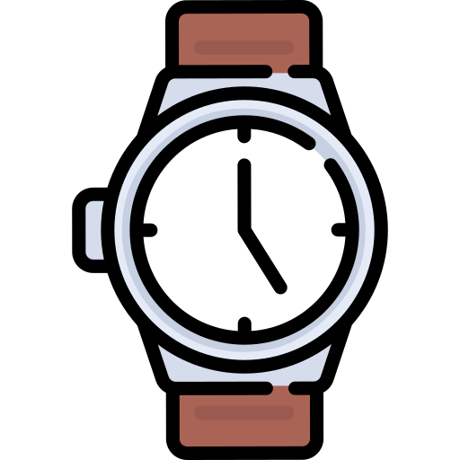

 

  

  <h3 align="center">Café do Vale</h3>
  

 <a href="https://ecmedeiros.github.io/ExactTime/"> Acessar o projeto </a>
  

    Projeto desenvolvido durante o curso de Bootstrap, tendo em visto o Mobile First sendo responsivo, este é um projeto que pode ser reaproveitado para diversos produtos, sendo usado com relógios neste exemplo.
     
     
  

## Sobre o projeto

    

